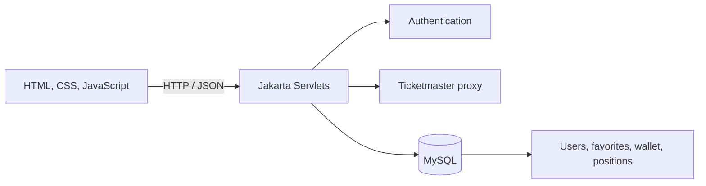

# TicketTrader

[](https://github.com/Jaime888888/TicketTrader/actions/workflows/ci.yml)

A full-stack event marketplace where users can discover live events, save favorites, and simulate ticket trading through a persistent wallet. TicketTrader combines a browser-based interface, Jakarta servlets, Ticketmaster-backed search, and a MySQL data model.

## Highlights

- Search events by keyword and city
- View event details and available price ranges
- Register and sign in with salted PBKDF2 password hashes and server-side sessions
- Save and remove favorite events
- Buy and sell positions through a persistent wallet
- Track cash, quantity, average cost, and estimated market value
- Surface backend and configuration failures instead of silently hiding them

## Architecture



## Technology

| Layer | Technology |
| --- | --- |
| Frontend | HTML, CSS, JavaScript |
| Backend | Java, Jakarta Servlet API |
| Database | MySQL, JDBC |
| Server | Apache Tomcat |
| External data | Ticketmaster-compatible search and event-detail endpoints |

## Main workflows

### Event discovery

The home page calls `/search` with a keyword and city, displays matching events, and loads additional information through `/eventDetail/{id}`. Events without a usable price range remain viewable but cannot be traded.

### Authentication and favorites

`/register` and `/login` create and validate users. The server rotates the session on authentication, stores the account ID in an HTTP-only session cookie, and derives ownership from that session for every wallet, trade, and favorite request.

### Wallet and trading

Every user receives a starting balance. `/trade` processes buy and sell requests, while `/wallet` returns cash, positions, average cost, and current valuation data.

## API surface

| Endpoint | Purpose |
| --- | --- |
| `POST /register` | Create an account |
| `POST /login` | Authenticate a user |
| `POST /logout` | Invalidate the current session |
| `GET /search` | Search available events |
| `GET /eventDetail/{id}` | Load event details |
| `GET/POST /favorites` | List or update saved events |
| `GET /wallet` | Load balances and positions |
| `POST /trade` | Execute a simulated buy or sell |

## Data model

- `users` stores account identities and password hashes.
- `favorites` associates saved Ticketmaster events with a user.
- `wallet` stores the user's available cash.
- `positions` stores ticket quantity, total cost, latest prices, and timestamps.
- `v_positions` calculates average cost and market value for reporting.

See [`setup.sql`](./setup.sql) for the complete schema.

## Project layout

```text
src/main/java/
├── api/                 # Servlets and shared request helpers
└── db/                  # JDBC connection and schema bootstrap
src/main/webapp/
├── WEB-INF/web.xml      # Servlet mappings
├── index.html           # Search and trading entry point
├── favorites.html       # Saved events
├── wallet.html          # Cash and positions
└── *.js / *.css         # Client logic and styles
build-support/           # Local compilation helper and servlet stubs
setup.sql                # MySQL schema
```

## Local setup

### Prerequisites

- JDK 17 or newer and Maven 3.9+
- MySQL 8
- Apache Tomcat 10.1 or another Servlet 6-compatible container

### 1. Create the database

```bash
mysql -u root -p < setup.sql
```

Create a dedicated local application account and use the same password in the next step:

```sql
CREATE USER IF NOT EXISTS 'tickettrader'@'localhost' IDENTIFIED BY 'replace-with-a-local-password';
GRANT ALL PRIVILEGES ON ticket_trader.* TO 'tickettrader'@'localhost';
```

The application can create missing tables inside the existing `ticket_trader` database, but it does not connect as MySQL root or attempt to create databases.

### 2. Configure database access

Use [`.env.example`](./.env.example) as a local template, replace its placeholder password, and export the values before starting Tomcat. For example, in Bash:

```bash
cp .env.example .env
# Edit .env, then export it into the current shell.
set -a
source .env
set +a
```

`TICKETTRADER_DB_USER` and `TICKETTRADER_DB_PASSWORD` are required. Host, port, and database name have local defaults. The application does not contain a database password and `.env` is ignored by Git.

### 3. Test and package

```bash
mvn verify
```

This runs the password-security tests and produces `target/tickettrader.war`.

### 4. Deploy and run

Deploy `target/tickettrader.war` to Tomcat, configure the database environment variables for the Tomcat process, and open the deployed context in a browser. Maven includes the MySQL driver in the WAR.

## Engineering notes

- Database-backed operations return visible errors when a servlet or MySQL is unavailable.
- Passwords are salted and stretched with PBKDF2-HMAC-SHA256; raw passwords are never stored by the browser.
- User-owned endpoints ignore client identity fields and authorize exclusively through the server session.
- Foreign keys cascade user deletion into wallet, favorite, and position data.
- The unique `(user_id, event_id)` constraints prevent duplicate favorites and positions.
- The project is a simulated marketplace and does not execute real financial transactions or ticket purchases.

