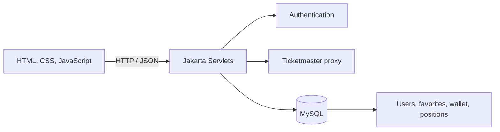

# TicketTrader

A full-stack event marketplace where users can discover live events, save favorites, and simulate ticket trading through a persistent wallet. TicketTrader combines a browser-based interface, Jakarta servlets, Ticketmaster-backed search, and a MySQL data model.

## Highlights

- Search events by keyword and city
- View event details and available price ranges
- Register and sign in with database-backed accounts
- Save and remove favorite events
- Buy and sell positions through a persistent wallet
- Track cash, quantity, average cost, and estimated market value
- Surface backend and configuration failures instead of silently hiding them

## Architecture



## Technology

| Layer | Technology |
| --- | --- |
| Frontend | HTML, CSS, JavaScript |
| Backend | Java, Jakarta Servlet API |
| Database | MySQL, JDBC |
| Server | Apache Tomcat |
| External data | Ticketmaster-compatible search and event-detail endpoints |

## Main workflows

### Event discovery

The home page calls `/search` with a keyword and city, displays matching events, and loads additional information through `/eventDetail/{id}`. Events without a usable price range remain viewable but cannot be traded.

### Authentication and favorites

`/register` and `/login` create and validate users. Signed-in users can persist favorites through `/favorites`; the navigation adapts to the current authentication state.

### Wallet and trading

Every user receives a starting balance. `/trade` processes buy and sell requests, while `/wallet` returns cash, positions, average cost, and current valuation data.

## API surface

| Endpoint | Purpose |
| --- | --- |
| `POST /register` | Create an account |
| `POST /login` | Authenticate a user |
| `GET /search` | Search available events |
| `GET /eventDetail/{id}` | Load event details |
| `GET/POST/DELETE /favorites` | Manage saved events |
| `GET /wallet` | Load balances and positions |
| `POST /trade` | Execute a simulated buy or sell |

## Data model

- `users` stores account identities and password hashes.
- `favorites` associates saved Ticketmaster events with a user.
- `wallet` stores the user's available cash.
- `positions` stores ticket quantity, total cost, latest prices, and timestamps.
- `v_positions` calculates average cost and market value for reporting.

See [`setup.sql`](./setup.sql) for the complete schema.

## Project layout

```text
src/main/java/
├── api/                 # Servlets for auth, search, favorites, wallet, and trades
├── db/                  # JDBC connection and schema bootstrap
└── util/                # JSON and shared helpers
src/main/webapp/
├── WEB-INF/web.xml      # Servlet mappings
├── index.html           # Search and trading entry point
├── favorites.html       # Saved events
├── wallet.html          # Cash and positions
└── *.js / *.css         # Client logic and styles
build-support/           # Local compilation helper and servlet stubs
setup.sql                # MySQL schema
```

## Local setup

### Prerequisites

- JDK 17 or newer
- MySQL 8
- Apache Tomcat 10.1 or another Servlet 6-compatible container
- A MySQL Connector/J driver available to the application

### 1. Create the database

```bash
mysql -u root -p < setup.sql
```

The application can also create its core schema during startup when the configured database account has sufficient permissions.

### 2. Configure database access

Update the local connection configuration in `src/main/java/db/JDBCConnector.java` for your environment.

> Do not commit real credentials. For any shared or deployed environment, load database settings from environment variables or a secret manager and rotate any credential that has previously been committed.

### 3. Compile the servlets

From Git Bash, WSL, macOS, or Linux:

```bash
bash build-support/compile.sh
```

The helper places compiled classes in `src/main/webapp/WEB-INF/classes` for an exploded Tomcat deployment.

### 4. Deploy and run

Configure `src/main/webapp` as an exploded web application in Tomcat, ensure the MySQL driver is on the runtime classpath, and open the deployed context in a browser.

## Engineering notes

- Database-backed operations return visible errors when a servlet or MySQL is unavailable.
- Foreign keys cascade user deletion into wallet, favorite, and position data.
- The unique `(user_id, event_id)` constraints prevent duplicate favorites and positions.
- The project is a simulated marketplace and does not execute real financial transactions or ticket purchases.

